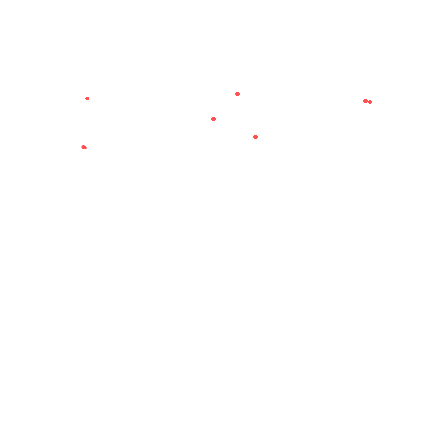

<html lang="en">
<head>
    <meta charset="UTF-8">
    <meta name="viewport" content="width=device-width, initial-scale=1.0">
    <title>RRX | YOUR AURA, YOUR RULES</title>
    <link href="https://fonts.googleapis.com/css2?family=Orbitron:wght@500;800&family=Rajdhani:wght@400;700&display=swap" rel="stylesheet">
    
</head>
<body>

    

        

            <h2 style="font-family: 'Orbitron'; color: var(--rrx-red); margin-bottom: 20px;">RRX STUDIOS</h2>
            
আপনার বিশ্বস্ত গেমিং মার্কেটপ্লেস। দ্রুত ডেলিভারি ও সিকিউর লেনদেনের নিশ্চয়তা।

            <button class="continue-btn" onclick="enterSite()">Enter RRX CORE</button>
        

    

    <header>
        
RRX

    </header>

    <main>
        <section class="hero">
            <h1>RRX CORE</h1>
            
YOUR AURA, YOUR RULES

        </section>

        

            

                
OFFER (STOCK OUT)

                

                <h3 style="font-size: 18px; min-height: 50px;">Minecraft Java + Bedrock Edition (Combo)</h3>
                ৳ 2,000
                <button class="rrx-btn" disabled>OUT OF STOCK</button>
            

            

                
OUT OF STOCK

                

                <h3 style="font-size: 18px; min-height: 50px;">Grand Theft Auto 5 | Online Premium Edition</h3>
                ৳ 2,100
                <button class="rrx-btn" disabled>OUT OF STOCK</button>
            

            

                
OFFER (STOCK OUT)

                

                <h3 style="font-size: 18px; min-height: 50px;">Forza Horizon 5 – Premium Edition</h3>
                ৳ 3,999
                <button class="rrx-btn" disabled>OUT OF STOCK</button>
            

        

    </main>

    <footer>
        
&copy; 2026 RRX BRAND | POWERED BY RRX STUDIOS

    </footer>

    
</body>
</html>
